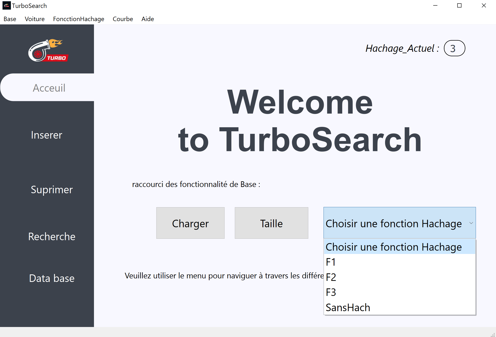
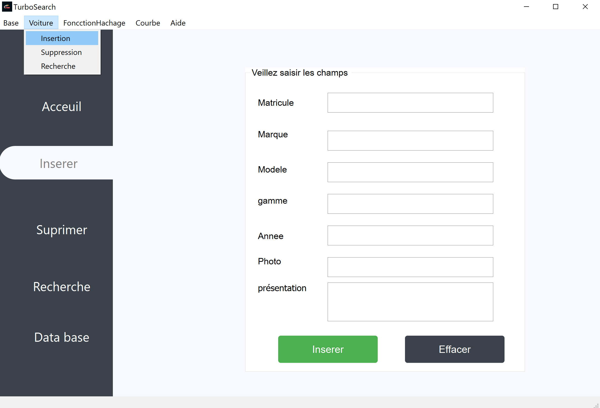
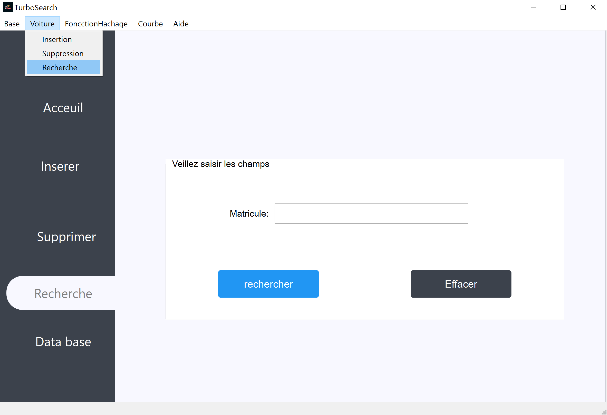
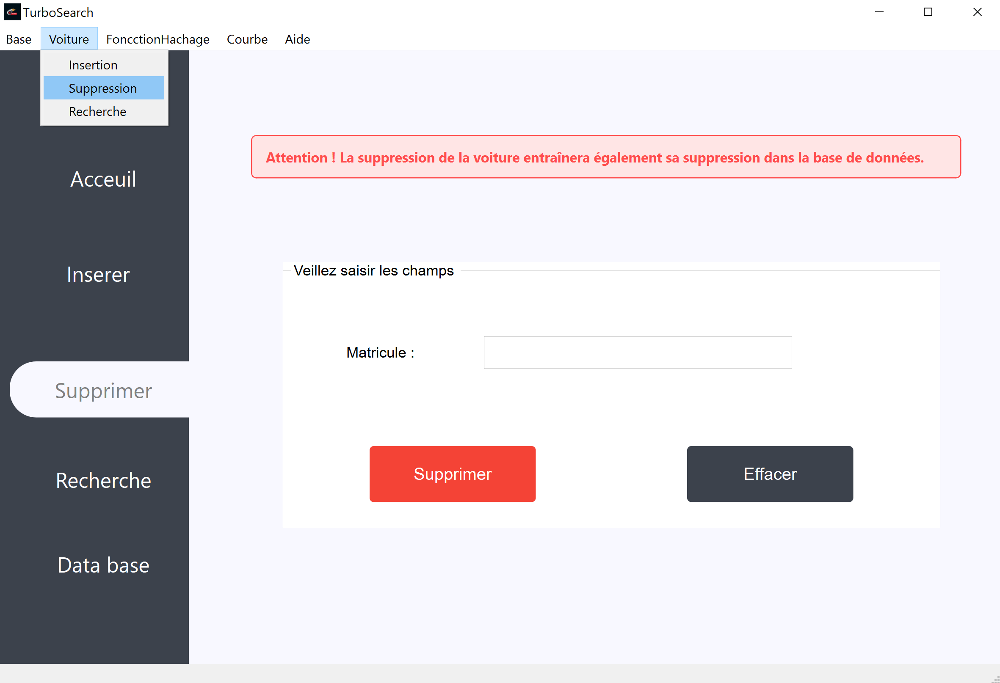
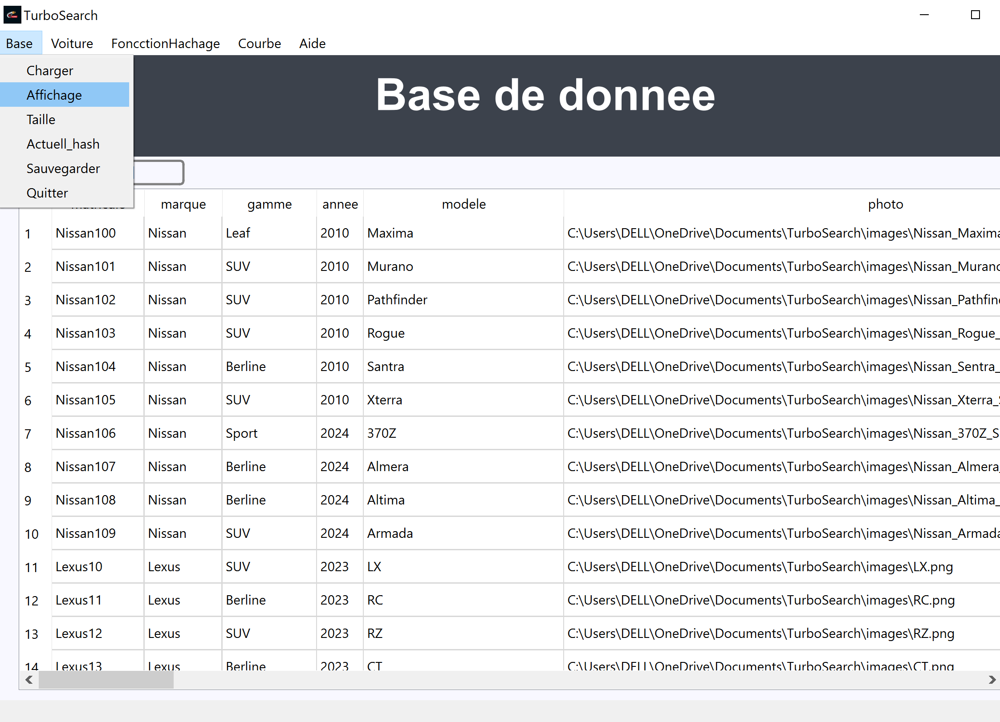

# TurboSearch

TurboSearch est une application de gestion de voitures en C++ utilisant Qt pour l'interface graphique et PostgreSQL pour la base de données. Elle permet l'insertion, la recherche, la suppression et l'affichage de voitures, optimisés par une table de hachage pour des recherches rapides. TurboSearch compare également l'efficacité de différentes fonctions de hachage.

## Fonctionnalités

### Page d'Accueil



Accédez à toutes les fonctionnalités depuis la page d'accueil.

### Insertion



Ajoutez de nouvelles voitures avec des informations détaillées.

### Recherche



Trouvez rapidement des voitures par matricule.

### Suppression



Supprimez des enregistrements de voitures par matricule.

### Affichage



Visualisez la liste des voitures enregistrées.


## Installation

1. Clonez le dépôt :
   ```sh
   git clone https://github.com/alimar440/turbosearch.git
